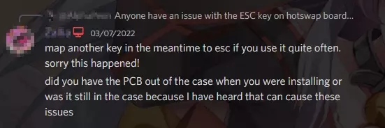

# Helix Lab AARU TKL 客製化鍵盤，第一次組裝就上手

## 前言
第一次使用機械式鍵盤大約是在大學唸資工系時，因為寫程式需要爽感才寫得下去，因此入手一個雜牌青軸。
一直到研究所時，陸續換了 Ducky One 2 櫻桃紅軸和 FILCO Majestouch 2 HAKUA 茶軸，大約接觸機械鍵盤四年了，總覺的不是自己喜歡的手感。
在某次聽 [Kana](https://twitter.com/kamikokana) 提到她有在玩 Customized Keyboard (客製化鍵盤)，她使用的正是 [AARU TKL](https://www.helix.site/products/group-buy-aaru-tkl)，當下我宛如發現新天地：原來機械鍵盤中還有比 Filco 厲害的存在 (價格上XD)，而且更好看、手感也更好。

當時查了 AARU TKL 真的對他的價格印象深刻，不過當時在台灣我找不太到資訊 (大概一年前)，但這把 AARU TKL 就不斷放我腦子裡，心想總有一天我要入坑。

這篇紀錄我第一次組裝客製化鍵盤的過程，包含潤軸、搞衛星軸的過程分享，希望供新手入坑參考，若過程有錯誤也歡迎留言指正 <(_ _)>

## Helix Lab 與 硬派
AARU TKL 是 Helix Lab 設計的第一款鍵盤，創辦人**佛屠**在網站上簡單說明他設計這款鍵盤的靈感來源，其中主要是來自*刺客教條：起源* (Assassin's Creed Original, ACO)中的古埃及意象和視覺感受，因此才想設計一款帶有聖書體(古埃及文字)設計的鍵盤:

> Inspiration of this design comes from an amalgamation of many traits, among which the most direct one being the game Assassin's Creed Origin (ACO) I recently played.
> 
> I was thoroughly amazed by the views and abundance of details of ancient Egypt that ACO has recreated, and thought to myself wouldn't it be nice to have a keyboard that's embossed with hieroglyphs like on walls or steles or papyri.

- [Helix Lab 官方網站](https://www.helix.site/)
- [Helix Lab 官方 Discord](https://discord.gg/YM4T7HH4XX)

直到 2022 三月，突然看到[硬派京璽](https://www.inpad.com.tw/)開了[團購](https://www.inpad.com.tw/product.php?act=view&id=7385)而且有現貨，因此決定著手組裝我的第一把客製化鍵盤。

- [硬派 Discord](https://discord.gg/teqyTnSHJ5)

在台灣玩客製化鍵盤，真的推硬派，他們什麼零件/工具都有，潤軸 (Lube) 的潤滑油 (Grease)、軸間紙 (Film) 和吸音棉等等，以及拔軸器/開軸器等等應有盡有，讓你不用跑遍蝦X還不一定找的到貨，也不用逛敝司的微笑A電商網站從國外買。
絕對不是頁配，這部落格沒什麼人看也不會有人掏錢請我寫這個，單純分享。

## 開箱

AARU 的外盒就充滿古埃及的設計，但說實在左下那個法老王的表情也太可愛了吧哈哈哈，像是 `OVO` 的樣子



內容包含：
1. Top & Bottom Frame (鋁合金上下蓋)
2. Plate + PCB (1.5mm 鋁定位板和1.6mm RGB熱插拔PCB板，原廠另外有焊接板，不過硬派GB是熱差拔版)
3. Underglow diffuser (底光擴散器)
4. Back Bar + TypeC badge (後條和Typc-C接口)
5. 六角螺絲(2.5)
6. SD卡 (說明書、QMK 工具程式、VIA和漂亮桌布)

1, 3, 4 已經鎖在一起了，因此組裝時需要再將上下蓋拆開。
這些內容等等會在分享組裝過程中一起放上照片。

## 開始組裝

因為我偏好線性軸體，因此住次挑了櫻桃紅軸，而且我想潤軸並加上軸間紙，因此買了以下的工具和零件 (如果是新手第一次玩，建議參考以下清單以免漏買零件QQ)：

- Cherry MX red * 100 顆，雖然 TKL 只需要 87 鍵，建議多買一些以免把軸體拆開時弄壞，也可以解決良率問題。
- Krytox 205g0 潤滑油
- 軸間紙 (我選擇 0.13mm，手感會比 0.15mm 軟)
- 開軸器
- 拔軸器
- 潤軸筆
- 夾軸器
- TYPE-C USB捲線 (這是玩客製化鍵盤必備，一定要用卷線！)
- 鍵帽
- 靜音棉 (墊在PCB板下面吸音用，Optional 不一定要買)
- 衛星軸 (須支援1.6mm pcb，2U*4 + 6.25U *1)
- 六角螺絲起子組

### 潤軸

首先將軸體用開軸器拆開，Cherry 軸旁邊有四個溝槽，對到開軸器 4 個角壓下去就可以打開了。
打開後將四個部份(軸的上蓋、下蓋、軸心和彈簧)分開，需要家刷上潤滑油的地方主要是軸的下蓋和軸心。

軸心因為很小，因此用夾軸器夾住十字的部份，需要刷上潤滑油的地方就是組件之間會接觸摩擦的地方，所以我是潤軸心的四個面：



尤其是其中兩側的凸起部份，這會和軸體下蓋的凹槽產生摩擦：



注意潤滑油的量不要太多 (Less is more!)，原則就是不要刷上去還看得到白色的油脂，如果看到白色油脂代表潤軸筆沾太多油了



接著潤軸體的下蓋，我潤的地方是下圖黃色圓圈部份的凹槽，以及底部用筆刷轉一圈潤一下：



接著加上軸間紙，軸間紙主要是減少軸心(紅色部份)的晃動 (to reduce wobbling)，會稍微讓軸變得比較緊，手感會紮時一些




網路上有些人會潤彈簧，但是我懶。

放好軸間紙之後，將彈簧、軸心依序放到下蓋上，就可以將軸體組回去：



這樣的動作要重複 87 次潤好 87 顆軸，我剛好是一邊看 Kana 打 Overwatch 一邊用，輕鬆悠閒 (離題了)。

### PCB板測試

這個是熱差拔版本的 PCB，可以看見每個 switch 都有自己的插槽，而且每個按鍵都已經焊上 LED 了。
附帶一題， AARU 的 firmware 有分「熱差拔 PCB」 以及 「焊接版 PCB」 兩種，更新 firmware 時才要注意。



PCB 背面可看見印上金色字體 "PCB designed by helix lab" 以及 logo




建議先測試 PCB 板，避免整個組裝好後發現某個按鍵沒反應，才懷疑是 PCB 的問題還是軸體的問題。
推薦使用 [Switch Hitter](https://m.majorgeeks.com/files/details/switch_hitter.html) 這個軟體進行測試，可以拿金屬鑷子之類的工具，輕輕接觸熱差拔插槽兩端金屬，形成通路來測試。




### 衛星軸安裝



我這次使用的是 [好再來衛星軸](https://www.inpad.com.tw/product.php?act=view&id=6813)，他的好處是出廠就已經調直鋼絲，我使用絕對平坦表面(手機螢幕)測試，真的很直了，不用再特別調直。



衛星軸當然也是要潤軸一下



接著是衛星軸的組裝，我找到下面這個網站有很詳細的說明和示意圖，圖片引用自：

https://www.keyboard.university/guides/using-screw-in-stabilizers-7nxj6

好再來衛星軸的零件與下圖類似，潤軸的部份是 Housings 內側與 Stems 外側，以及鋼絲 (Wire) 插入 housing and stem 的地方。




潤軸完畢，將 Stem 插入 Housing，注意紅色圈圈的地方，Stem 上面有一個缺口，插入 housing 要對應到橘色圈圈 (有鎖螺絲的地方)，要在同一側。



將鋼絲插入 stem **下方** 的洞口，如圖：



接著將鋼絲稍微用力卡進 housing 的卡扣裡面固定：



接著因為好再來應該是支援 1.6mm 的 PCB，不過他有附墊片，AARU 其實是 1.5mm 的，因此先將衛星軸附的墊片黏上PCB



接著拿出 PCB，找到安裝衛星軸的洞口：先將 Housing 突出的地方卡入較大的洞口(圖中橘色標示的洞口)，接著在圖片中紅色標示的洞口處鎖上螺絲


完成



### 安裝軸體

先在 PCB 上面鋪上減震橡膠墊，再放上定位板，注意洞口要對齊
在四個角落的地方先插上軸體，以固定 PCB/減震墊及定位板。





接著插上所有軸體



注意安裝軸體/更換軸體時，一定要將 PCB 拿出外殼才插上軸體，我看到有國外朋友 PCB 先裝在鍵盤外殼內才插上軸體，結果熱差拔插槽脫落的悲劇發生...

### 外殼組裝



包裝內的外殼上下蓋原本是裝在一起的，需要分離，要準備六腳螺絲起子拆開。
上蓋的部份：



將 PCB 鎖到上蓋



接下來是下蓋，AARU 最帥氣的金色荷魯斯之眼，需要鎖在下蓋




下蓋有 *Designed By Helix Lab* 字樣，十分精緻 ~~雖然看不到~~



在下蓋鋪上靜音棉，注意靜音棉的尺寸不要擋到 LED 底光擴散器，才能讓 PCB 上的 LED 亮光從鍵盤背部擴散開來。
最後將上下蓋鎖上，這樣只剩安裝鍵帽了。



### 鍵帽

鍵帽的選擇對我而言十分困難，因為個人這次想要的鍵帽是：白色、PBT、兩色成型 (不要熱昇華或雷雕)、英文、不透光、非Ducky製以及非淘寶。

剛好硬派有出 [108鍵 黑白 PBT二色鍵帽組](https://www.inpad.com.tw/product.php?act=view&id=7150)，符合上條件 (雖然不是全白)，但是價格划算，因此先暫時使用這款。
之後來等等看 Mass Drop 出我喜歡的款式及 profile 吧。



### 晒圖

組裝完成就可以拍照晒圖



外殼作工精細，可以看見埃及象形文字的浮雕



底光擴散器將 PCB 最上排的燈光從背部擴散出來，有光害、才有厲害！



AARU 的 LED 燈光可以用鍵盤 menu 鍵調整亮度、模式及彩度，我超喜歡用漸層模式搭配低彩度，可以當作非常有格調的氣氛燈。

AARU 附贈的 SD 卡內有說明書，有寫到燈光設定的方式以及韌體更新以及 Keymap 等等。



## 結語

我的感想是...好爽喔！終於入坑了哈哈。
AARU 的手感真的很棒，絕對勝過那種 5000 塊的鍵盤。因為鋁定位板和鋁合金外殼的關係，整體的塑膠感也降低，非常沉穩，當然本體也重了不少。

我認為 AARU 已經是藝術品般的存在，但是作為重要的生財器具我覺得非常值得，
在接觸機械鍵盤的旅程中，AARU 開啟了我對客製化鍵盤的視野，它將會陪伴我一同[開創事業]^(上班賺錢)許久，不過，我相信這只是一個開端，日後我還會嘗試不同線性軸體以及 65% 客製化鍵盤，但是 AARU 在心中已經是不能被取代的地位。

